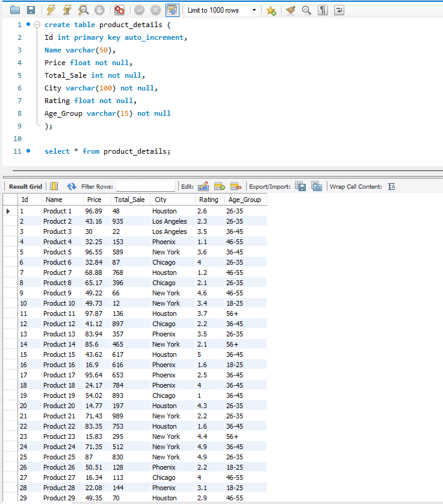
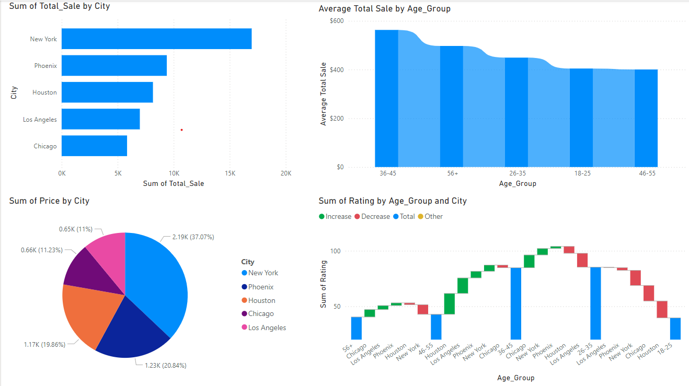

# Assessment

## Setup

- Python 3
- Pip
- PowerBi
- MySQL

> Copy variables from [.env.sample](.env.sample) and create a file `.env` in the root directory and provide your database connection values

> Create a database in your MySQL server and create the table from [Project_DB.sql](queries/Project_DB.sql)


## Commands to get started
```bash
pip install -r requirements.txt

py fabricate_dataset.py # This will generate a xlsx file `fabricated_data.xlsx`

py Import2SQL.py # This will read the xlsx file and insert into the table in MySQL database server
```

## Links
- Open PowerBI file from [Product_Data_Visual.pbix](powerBI_data/Product_Data_Visual.pbix)

## Images
MySQL workbench showing dataset loaded in the table

Final visualization from PowerBi
